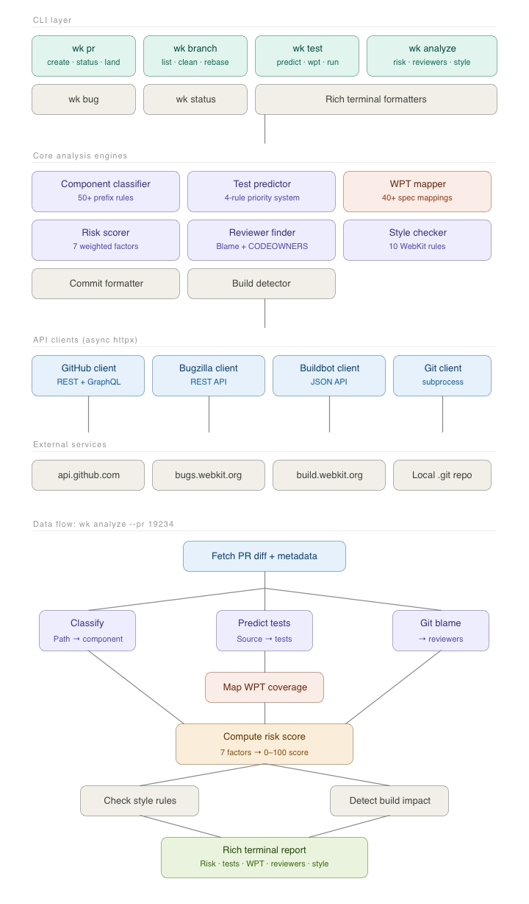

# wk — WebKit Contributor Toolkit

**A comprehensive CLI toolkit for WebKit developers** that predicts test failures, maps WPT coverage gaps, scores change risk, suggests reviewers, and streamlines PR workflows. Built for the WebKit Developer Productivity team's mission of improving contributor velocity through intelligent tooling — `wk` brings together static analysis, build-system awareness, and API integrations into a single command-line interface that understands the WebKit codebase structure.

---

## Quick Start

```bash
pip install -e .
wk analyze full --demo
```

This runs the full analysis pipeline with demo data — risk assessment, component impact, test prediction, WPT coverage, reviewer suggestions, style checking, and commit message generation — all in one command.

---

## Architecture



**Data flow for `wk analyze full`:**

```
git diff → changed files
     ├──→ ComponentClassifier  → component breakdown
     ├──→ TestPredictor        → predicted test suite
     ├──→ WPTMapper            → WPT coverage report
     ├──→ RiskScorer           → 0-100 risk score
     ├──→ ReviewerFinder       → ranked reviewer list
     ├──→ StyleChecker         → style violations
     ├──→ BuildDetector        → build system warnings
     └──→ CommitFormatter      → WebKit-format commit message
```

---

## CLI Commands

| Command | Description |
|---|---|
| `wk analyze full` | **THE KEY COMMAND** — runs all analysis engines in a single report |
| `wk analyze risk` | Compute 0-100 risk score with 7 weighted factors |
| `wk analyze reviewers` | Suggest reviewers from git blame + CODEOWNERS |
| `wk analyze style` | Check WebKit coding conventions (7 rules) |
| `wk analyze wpt` | Map changed source files to WPT spec coverage |
| `wk pr list` | List recent pull requests with status |
| `wk pr status <n>` | Show detailed PR status, CI checks, reviews |
| `wk pr create` | Preview PR creation from current branch |
| `wk pr land <n>` | Preview WebKit-format commit message for landing |
| `wk branch list` | List branches with ahead/behind tracking |
| `wk branch clean` | Find merged branches safe to delete |
| `wk branch rebase` | Rebase current branch onto main |
| `wk test predict` | Predict which tests to run for changed files |
| `wk test wpt-check` | Check WPT coverage for changed source files |
| `wk test run` | Execute predicted test suite |
| `wk bug link <id>` | Link a Bugzilla bug to the current branch |
| `wk bug create` | Create a new Bugzilla bug from current changes |
| `wk bug sync` | Sync bug status between Bugzilla and GitHub |
| `wk status` | Dense overview of branch, PR, and CI state |

> **WPT Integration**: The WebKit Developer Productivity team's description explicitly calls out Web Platform Tests. `wk analyze wpt` and `wk test wpt-check` map 40+ WebCore source patterns to their corresponding WPT spec directories, identifying coverage gaps before code review. This ensures that changes to CSS, DOM, Fetch, WebGPU, and other web platform features have corresponding WPT test coverage.

Every command supports a `--demo` flag for testing without a live git repository or API credentials.

---

## Key Algorithms

### a) Component Classifier — Longest-Prefix Matching

WebKit has 260,000+ source files spread across deeply nested directories. The `ComponentClassifier` maps any file path to its logical component using **longest-prefix matching** over ~50 hand-curated prefix entries.

**How it works:**
1. A prefix map associates path prefixes with component names (e.g., `Source/WebCore/css/` maps to `WebCore/CSS`, `Source/JavaScriptCore/dfg/` maps to `JSC/DFG`).
2. Prefixes are sorted by length in descending order — longest first.
3. For any input path, the classifier walks the sorted list and returns the first match. This ensures `Source/WebCore/css/` matches `WebCore/CSS` before the shorter `Source/WebCore/` matches `WebCore`.
4. Platform-specific detection recognizes `/cocoa/`, `/glib/`, `/win/`, `/gtk/`, `/wpe/` path segments.

```python
classifier = ComponentClassifier()
classifier.classify("Source/WebCore/css/CSSSelector.cpp")      # → "WebCore/CSS"
classifier.classify("Source/JavaScriptCore/dfg/DFGGraph.cpp")  # → "JSC/DFG"
classifier.classify("Source/WebKit/UIProcess/API/Cocoa/WK.h")  # → "WebKit/UIProcess"
```

### b) Test Predictor — 4-Rule Priority System

Given a set of changed source files, the `TestPredictor` predicts which tests are most likely to be affected using four rules applied in priority order:

| Priority | Rule | Relevance | Example |
|---|---|---|---|
| 1 | **Direct match** | 0.90-0.95 | `WebCore/css/` → `LayoutTests/fast/css/` |
| 2 | **API test** | 0.80 | `WebCore/` → `Tools/TestWebKitAPI/Tests/WebCore/` |
| 3 | **WPT** | 0.70 | `WebCore/css/` → `LayoutTests/imported/w3c/web-platform-tests/css/` |
| 4 | **Component fallback** | 0.30-0.50 | Falls back to component-level test directory |

**Deduplication**: When multiple rules predict the same test path, only the highest-relevance entry is kept. Results are sorted by relevance score descending.

### c) WPT Coverage Mapper — Source-to-Spec Mapping

The WebKit Developer Productivity team's job description explicitly mentions WPT (Web Platform Tests) integration. The `WPTMapper` addresses this by mapping 40+ WebCore source patterns to their corresponding WPT spec directories.

**Why this matters**: When a contributor modifies `Source/WebCore/css/CSSSelector.cpp`, they should know whether WPT tests exist for CSS Selectors (`css/selectors/`) and whether they need to update or add tests.

**How it works:**
1. `SOURCE_TO_WPT_SPEC` maps 43 WebCore subdirectory patterns to WPT spec names (e.g., `css/CSSSelector` → `css/selectors`, `dom/MutationObserver` → `dom/mutations`, `Modules/fetch` → `fetch`).
2. For each changed file under `Source/WebCore/`, the mapper checks if its path matches any known pattern.
3. Matched files produce `WPTSpecMatch` entries with the spec name and expected test path.
4. Unmatched WebCore files (excluding `platform/`, `bindings/`, etc.) are flagged as `MissingWPTCoverage`.
5. A coverage score (0.0-1.0) summarizes what fraction of changes have WPT spec mappings.

### d) Risk Scorer — 7-Factor Weighted Formula

The `RiskScorer` computes a **0-100 risk score** using seven weighted factors:

| Factor | Weight | What It Measures |
|---|---|---|
| `cross_component` | 0.20 | Number of distinct components touched (more = riskier) |
| `file_hotness` | 0.20 | Are the changed files frequently modified? (churn = risk) |
| `diff_size` | 0.15 | Total lines added + deleted (large diffs = risk) |
| `platform_specificity` | 0.15 | Fraction of files that are platform-specific |
| `test_coverage` | 0.15 | Ratio of test files to source files (**inverted**: high coverage = low risk) |
| `wpt_coverage` | 0.10 | WPT coverage score from WPTMapper (**inverted**: high coverage = low risk) |
| `review_complexity` | 0.05 | Number of reviewers needed based on component spread |

**Formula**: `score = sum(normalize(factor_i) * weight_i) * 100`, clamped to [0, 100].

**Risk levels**:
- **LOW** (0-25): Safe to merge with standard review
- **MODERATE** (26-50): Deserves careful review, consider splitting
- **HIGH** (51-75): Needs thorough review, extra testing recommended
- **CRITICAL** (76-100): Consider splitting into smaller PRs

**Inverted normalization** for coverage factors ensures that high test/WPT coverage *reduces* the risk score rather than increasing it.

### e) Reviewer Finder — Blame-Based Scoring with CODEOWNERS

The `ReviewerFinder` suggests reviewers by analyzing git blame data with recency weighting and CODEOWNERS integration.

**Scoring algorithm:**
1. For each blame entry, compute `recency_weight = 1.0 / (days_since_commit + 1)`.
2. Accumulate scores per author across all changed files.
3. If a `CODEOWNERS` file exists, authors listed as code owners get a **2x score boost**.
4. The PR author is automatically excluded from suggestions.
5. Expertise areas are derived from the `ComponentClassifier` — each reviewer's score breakdown by component is tracked.
6. Results are sorted by total score descending, top 5 returned.

---

## Sample Output

Running `wk analyze full --demo` produces the complete analysis report:

```
────────────────────────── wk-toolkit Analysis Report ──────────────────────────

╭────────────────────────────── RISK ASSESSMENT ───────────────────────────────╮
│ █████████████░░░░░░░░░░░░░░░░░ 44/100                                       │
│ MODERATE  —  MODERATE risk (44/100): 4 components, 191 lines changed        │
│                                                                             │
│ Recommendations:                                                            │
│   • Consider splitting this PR — it touches 4 components                    │
│   • Test coverage is low (40%) — consider adding tests                      │
╰─────────────────────────────────────────────────────────────────────────────╯

               COMPONENT IMPACT
┏━━━━━━━━━━━━━━━━━┳━━━━━━━┳━━━━━━━━━━━━━━━━━━━┓
┃ Component       ┃ Files ┃ Platform-specific ┃
┡━━━━━━━━━━━━━━━━━╇━━━━━━━╇━━━━━━━━━━━━━━━━━━━┩
│ LayoutTests/CSS │     1 │                   │
│ LayoutTests/WPT │     1 │                   │
│ WebCore         │     1 │                   │
│ WebCore/CSS     │     2 │                   │
└─────────────────┴───────┴───────────────────┘

                                PREDICTED TESTS
┏━━━━━━━━━━━━━━━━━━━━━━┳━━━━━━━━━━━━━━━━━━━━━━━━━━━━━━━━━━━━━━━━━━━┳━━━━━━━━━━━┓
┃ Type                 ┃ Test Path                                 ┃ Relevance ┃
┡━━━━━━━━━━━━━━━━━━━━━━╇━━━━━━━━━━━━━━━━━━━━━━━━━━━━━━━━━━━━━━━━━━━╇━━━━━━━━━━━┩
│ Layout Tests         │ LayoutTests/fast/css/                     │      0.95 │
│ API Tests            │ Tools/TestWebKitAPI/Tests/WebCore/CSSSel… │      0.80 │
│ API Tests            │ Tools/TestWebKitAPI/Tests/WebCore/StyleR… │      0.80 │
│ WPT Tests            │ LayoutTests/imported/w3c/web-platform-te… │      0.70 │
└──────────────────────┴───────────────────────────────────────────┴───────────┘

╭──────────────────────────────── WPT COVERAGE ────────────────────────────────╮
│ Coverage score: 67%                                                         │
│ WPT specs found: 1                                                          │
│                                                                             │
│ Covered specs:                                                              │
│   ✅ css/selectors (css/selectors/*.html)                                   │
╰─────────────────────────────────────────────────────────────────────────────╯

                             SUGGESTED REVIEWERS
┏━━━━━┳━━━━━━━━━━━━━━━━┳━━━━━━━┳━━━━━━━━━┳━━━━━━━━━━━━━━━━━━━━━━┳━━━━━━━━━━━━┓
┃ #   ┃ Name           ┃ Score ┃ Commits ┃ Expertise            ┃ CODEOWNER  ┃
┡━━━━━╇━━━━━━━━━━━━━━━━╇━━━━━━━╇━━━━━━━━━╇━━━━━━━━━━━━━━━━━━━━━━╇━━━━━━━━━━━━┩
│ 1   │ Antti Koivisto │ 1.682 │       3 │ WebCore/CSS          │ ✅         │
│ 2   │ Darin Adler    │ 0.173 │       2 │ WebCore, WebCore/CSS │            │
│ 3   │ Antoine Quint  │ 0.167 │       1 │ WebCore/CSS          │            │
│ 4   │ Sam Weinig     │ 0.067 │       1 │ WebCore              │            │
└─────┴────────────────┴───────┴─────────┴──────────────────────┴────────────┘

  ✅ No style violations found

  ⚠️  [new_source_files] New source file may need Sources.txt entry
      Source/WebCore/css/CSSSelector.cpp
      Source/WebCore/style/StyleResolver.cpp

╭─────────────────────────────── COMMIT MESSAGE ───────────────────────────────╮
│ [WebCore] Improve :has() selector matching                                  │
│                                                                             │
│ Reviewed by: Antti Koivisto.                                                │
│                                                                             │
│ * Source/WebCore/css/CSSSelector.cpp:                                       │
│ * Source/WebCore/css/CSSSelector.h:                                         │
│ * Source/WebCore/style/StyleResolver.cpp:                                   │
│ * LayoutTests/fast/css/has-selector-invalidation.html:                      │
│ * LayoutTests/imported/w3c/web-platform-tests/css/selectors/has/has-basic…  │
╰─────────────────────────────────────────────────────────────────────────────╯
```

---

## Why This Exists

WebKit's existing `webkit-patch` tool handles basic PR operations, but doesn't predict test failures, map WPT coverage, score change risk, or suggest reviewers. `wk` fills these gaps with algorithms specifically designed for WebKit's codebase structure and contribution workflow.

---

## Testing

263 tests covering every algorithm, CLI command, and integration path:

```bash
# Run the full suite
pytest tests/ -v

# Run a specific module
pytest tests/test_risk_scorer.py -v

# Run integration tests only
pytest tests/test_integration.py -v
```

**Test breakdown:**

| Test File | Tests | What It Covers |
|---|---|---|
| `test_component_classifier.py` | 76 | All ~50 prefix entries, edge cases, platform detection |
| `test_test_predictor.py` | 27 | 4-rule priority system, deduplication, relevance scores |
| `test_wpt_mapper.py` | 25 | Source-to-spec mappings, coverage scoring, recommendations |
| `test_risk_scorer.py` | 26 | All 7 factors, level thresholds, weight math |
| `test_reviewer_finder.py` | 13 | Blame scoring, CODEOWNERS parsing, PR author filtering |
| `test_style_checker.py` | 22 | All 7 style rules, diff parsing |
| `test_commit_formatter.py` | 16 | WebKit format, file annotations, validation |
| `test_build_detector.py` | 22 | All 7 detection rules, build impact detection |
| `test_bugzilla_extract.py` | 10 | Bug ID extraction from 3 URL/text patterns |
| `test_integration.py` | 26 | All CLI commands via CliRunner, help screens, demo mode |

---

## Project Structure

```
wk_toolkit/
├── README.md
├── setup.py
├── pyproject.toml
├── requirements.txt
├── .env.example
├── .github/
│   └── workflows/
│       └── ci.yml                  # GitHub Actions CI (Python 3.10-3.12)
├── wk_toolkit/
│   ├── __init__.py                 # Package version (1.0.0)
│   ├── cli.py                      # Main entry point (Click group)
│   ├── config.py                   # Config dataclass + Components constants
│   ├── core/
│   │   ├── __init__.py
│   │   ├── component_classifier.py # 50-prefix file→component mapper
│   │   ├── test_predictor.py       # 4-rule test prediction engine
│   │   ├── wpt_mapper.py           # 43-pattern WPT coverage mapper
│   │   ├── risk_scorer.py          # 7-factor risk scoring (0-100)
│   │   ├── reviewer_finder.py      # Blame-based reviewer suggestions
│   │   ├── style_checker.py        # 7-rule WebKit style checker
│   │   ├── commit_formatter.py     # WebKit-format commit messages
│   │   └── build_detector.py       # 7-category build impact detector
│   ├── clients/
│   │   ├── __init__.py
│   │   ├── github_client.py        # Async GitHub REST API v3 client
│   │   ├── bugzilla_client.py      # Async Bugzilla REST API client
│   │   ├── buildbot_client.py      # Async BuildBot + EWS client
│   │   └── git_client.py           # Local git subprocess wrapper
│   ├── commands/
│   │   ├── __init__.py
│   │   ├── analyze.py              # wk analyze (full/risk/reviewers/style/wpt)
│   │   ├── pr.py                   # wk pr (list/status/create/land)
│   │   ├── branch.py               # wk branch (list/clean/rebase)
│   │   ├── test.py                 # wk test (predict/wpt-check/run)
│   │   ├── bug.py                  # wk bug (link/create/sync)
│   │   └── status.py               # wk status
│   └── formatters/
│       ├── __init__.py
│       └── rich_output.py          # Shared Rich formatting helpers
└── tests/
    ├── __init__.py
    ├── test_component_classifier.py    # 76 tests
    ├── test_test_predictor.py          # 27 tests
    ├── test_wpt_mapper.py              # 25 tests
    ├── test_risk_scorer.py             # 26 tests
    ├── test_reviewer_finder.py         # 13 tests
    ├── test_style_checker.py           # 22 tests
    ├── test_commit_formatter.py        # 16 tests
    ├── test_build_detector.py          # 22 tests
    ├── test_bugzilla_extract.py        # 10 tests
    └── test_integration.py             # 26 tests
```

---

## Configuration

Copy `.env.example` to `.env` and fill in your tokens:

```bash
cp .env.example .env
```

| Variable | Required | Description |
|---|---|---|
| `GITHUB_TOKEN` | For PR/review features | GitHub personal access token |
| `BUGZILLA_API_KEY` | For bug tracking | bugs.webkit.org API key |
| `WK_DATA_DIR` | Optional | Data directory (default: `~/.wk-toolkit`) |

All commands work in `--demo` mode without any configuration.
